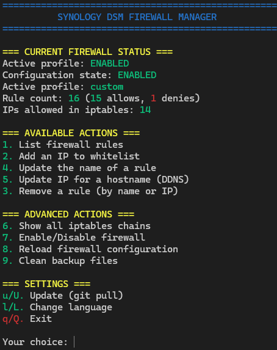

# Synology Firewall CLI Tools (DSM 7.x)

Shell scripts to manage Synology DSM 7.x firewall rules dynamically via SSH, without using the web GUI.

## 🔧 Included Scripts

- `manage.sh`: Main CLI interface with menu to manage all firewall operations
- `add_firewall_ip.sh`: Adds an IP address to the Synology firewall whitelist
- `remove_firewall_ip.sh`: Removes a firewall rule by its name (IP or hostname)
- `list_firewall_rules.sh`: Lists firewall rules with their name, IP address(es), and status
- `update_hostname_ip.sh`: Resolves a hostname (e.g., DDNS) and updates the firewall rule if the associated IP changes
- `rotate_logs_ip.sh`: Rotates the log file `/var/log/update_noip.log` when it exceeds 1MB
- `update_firewall_rule_name.sh`: Updates the "name" field of a firewall rule matching a specific IP address

---

## ⚙️ Requirements

- Root SSH access to the NAS
- `jq` installed (`sudo synogear install jq` or via `ipkg`)
- DSM 7.x with active firewall configuration

---

## 📦 Installation

Copy all scripts into a directory on your NAS, for example:

```bash
/volume1/homes/YourUser/scripts/cli-tools/synology/
```

Then make them executable:

```bash
chmod +x *.sh
```

---

## 🧪 Usage

### Main Menu Interface

The easiest way to use these tools is through the main menu interface:

```bash
./manage.sh
```



This interactive menu provides access to all firewall management functions:

- List firewall rules
- Add an IP to the whitelist
- Remove a rule
- Update rule names
- Update IP for a hostname (DDNS)
- View iptables rules
- Enable/disable firewall
- Reload firewall configuration
- Clean up backup files
- Update scripts (via git pull)

### Individual Script Usage

If you prefer, you can also use the individual scripts directly:

#### Add an IP to the firewall whitelist

```bash
./add_firewall_ip.sh 192.168.1.100 myhome.ddns.net
```

If no hostname is provided, the IP address is used as the rule name.

#### Remove a firewall rule

```bash
./remove_firewall_ip.sh myhome.ddns.net
```

or

```bash
./remove_firewall_ip.sh 192.168.1.100
```

#### List firewall rules

```bash
./list_firewall_rules.sh
```

#### Update rule dynamically based on a hostname (e.g., DDNS)

```bash
./update_hostname_ip.sh myhome.ddns.net
```

If no argument is provided, it defaults to `myhome.ddns.net`.

#### Rotate log file

```bash
./rotate_logs_ip.sh
```

#### Update the name of a specific firewall rule

```bash
./update_firewall_rule_name.sh 192.168.1.100 myhome.ddns.net
```

This command will locate the rule containing the specified IP and update its `"name"` attribute.  
After execution, `list_firewall_rules.sh` will be called automatically to verify the result.

---

## 🛠️ Schedule via DSM GUI (Task Scheduler)

You can run `update_hostname_ip.sh` and `rotate_logs_ip.sh` automatically using Synology's Task Scheduler.

### Step-by-step (DSM GUI):

1. Open **Control Panel** → **Task Scheduler**
2. Click **Create** → **Scheduled Task** → **User-defined script**
3. Under the **General** tab:
   - Name: `Update DDNS IP`
   - User: `root`
4. Under the **Schedule** tab:
   - Set to run every 30 minutes (or as needed)
5. Under the **Task Settings** tab:
   - Paste the command:
     ```bash
     /volume1/homes/YourUser/scripts/cli-tools/synology/update_hostname_ip.sh
     ```
6. Repeat steps for `rotate_logs_ip.sh`, if desired.

## Screenshots

- [Task scheduler](screenshots/chrome_WnCAkr6PxU.png)
- [Update DDNS - General](screenshots/chrome_d9BmIjVpfx.png)
- [Update DDNS - Schedule](screenshots/chrome_kDxHyPqbSJ.png)
- [Update DDNS - Task](screenshots/chrome_rvF9eaVECz.png)
- [Rotate logs - Schedule](screenshots/chrome_8nY67MK55r.png)
- [Rotate logs - Task](screenshots/chrome_NKUCBflL0W.png)
- [Firewall Manager GUI](screenshots/q1D882Yzbk.png)

---

## 🔐 Safety & Implementation Details

### How the Scripts Work Internally

These scripts follow best practices for modifying the Synology firewall configuration:

1. **Official API Usage**: All permanent changes to the firewall configuration use the Synology's official firewall API, not direct iptables manipulations:
   - Scripts modify the JSON configuration files in `/usr/syno/etc/firewall.d/`
   - After modifications, they call `/usr/syno/bin/synofirewall --reload` to apply changes

2. **Typical Workflow**:
   - Identify the active firewall profile configuration file
   - Create a timestamped backup of this file
   - Modify the JSON by adding/removing/changing rules
   - Reload configuration through Synology's firewall API
   - If any errors occur, restore the backup automatically

3. **Iptables Commands** are used only for:
   - Displaying current status (`iptables -S`, `iptables -L`)
   - Verifying if rules were applied correctly
   - Detecting if the firewall is active

4. **Error Handling**: If the Synology API reports an error during reload, the original configuration is automatically restored to maintain firewall functionality.

This approach ensures that all changes are:
- Persistent across reboots
- Compatible with DSM's implementation
- Properly tracked in DSM's configuration system
- Safe with automatic rollback on errors

### Backup Safety

Every firewall config change is backed up with a timestamp. If something fails, the previous file is automatically restored and the firewall reloaded.

---

## 🧾 IP Change History

The file `/tmp/home_ip_history.txt` tracks IP changes for the monitored hostname. Delete it to reset tracking.

---

## 📝 License

MIT – Use at your own risk.